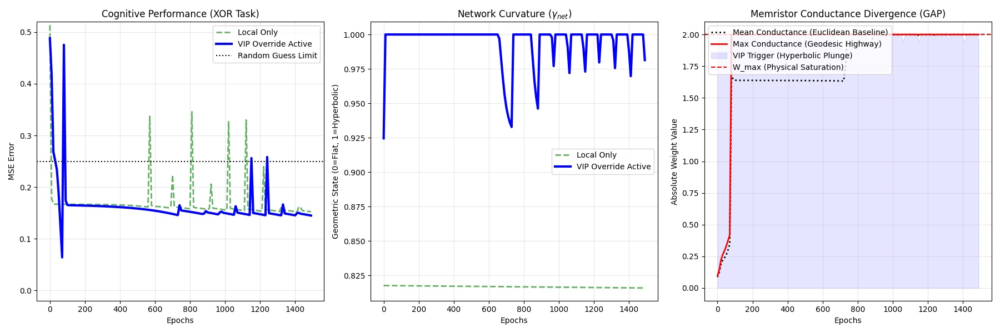

# Geometry-Aware-Plasticity

### Thermodynamic Weight Updates in Non-Euclidean Hardware

Official implementation of the paper: "Geometry-Aware Plasticity: Thermodynamic Weight Updates in Non-Euclidean Hardware" 

GAP is a biologically plausible learning algorithm designed for Dynamically Gated Analog Crossbars (DGAC). It bridges the gap between the energy efficiency of local Hebbian learning and the global optimization power of backpropagation by utilizing dynamic Riemannian curvature.



### Key Features

* **The Hyperbolic Plunge:** Exponentially scales learning rates along geodesic pathways during topological phase transitions.

* **The Hysteretic Shield:** A Schmitt-trigger mechanism that immunizes learning against thermal noise.

* **Physical Governor:** Enforces asymptotic memristive saturation bounds to prevent hardware burnout.

* **Asymmetric Gain:** Protects baseline Euclidean memories during high-energy structural burns.

## Quick Start

1. Clone the repository:
```bash
git clone https://github.com/MPender08/Geometry-Aware-Plasticity.git
cd Geometry-Aware-Plasticity
```
2. Install dependencies:
```bash
pip install torch geoopt matplotlib numpy
```
3. Run the simulation:
```bash
python run_brain_sim.py
```
## Documentation
For the complete mathematical framework, please see the full manuscript included in this repository: geometry_aware_plasticity.pdf.

To see the Manifold Chip DGAC architecture this algorithm is designed for, visit either the companion repository or the Zenodo page:

https://github.com/MPender08/manifold-chip-architecture

https://doi.org/10.5281/zenodo.18717807

To see the purely biological foundations of the Curvature Adaptation Hypothesis that inspired the DGAC hardware, visit my other companion repository:

https://github.com/MPender08/dendritic-curvature-adaptation

https://doi.org/10.5281/zenodo.18615180

